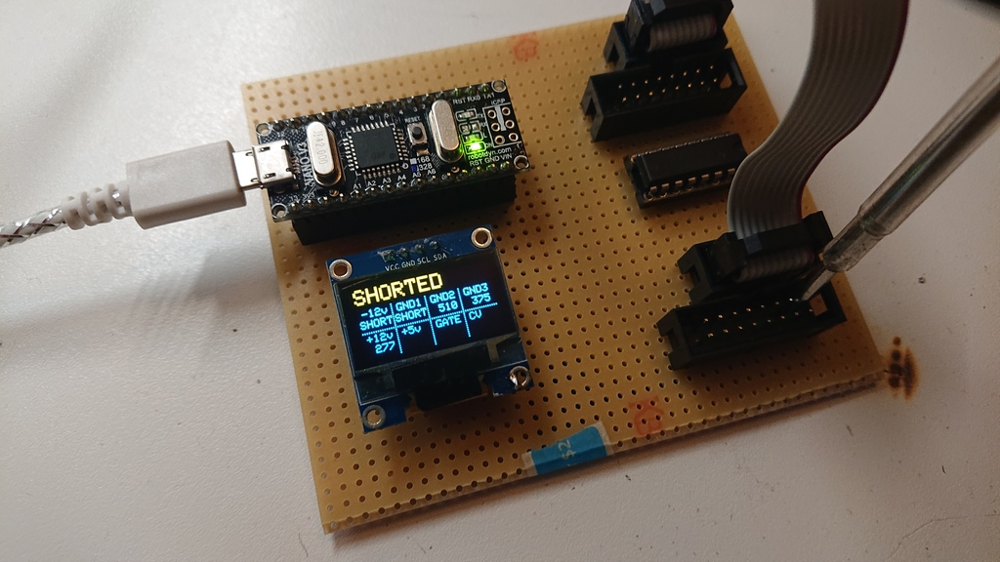

Arduino 10/16 pin Eurorack IDC Power Cable Tester
=================================================

* It only tests (max) 8 wires because of how they're wired in eurorack.
* It can detect shorted cables or faulty/unconnected wires.

